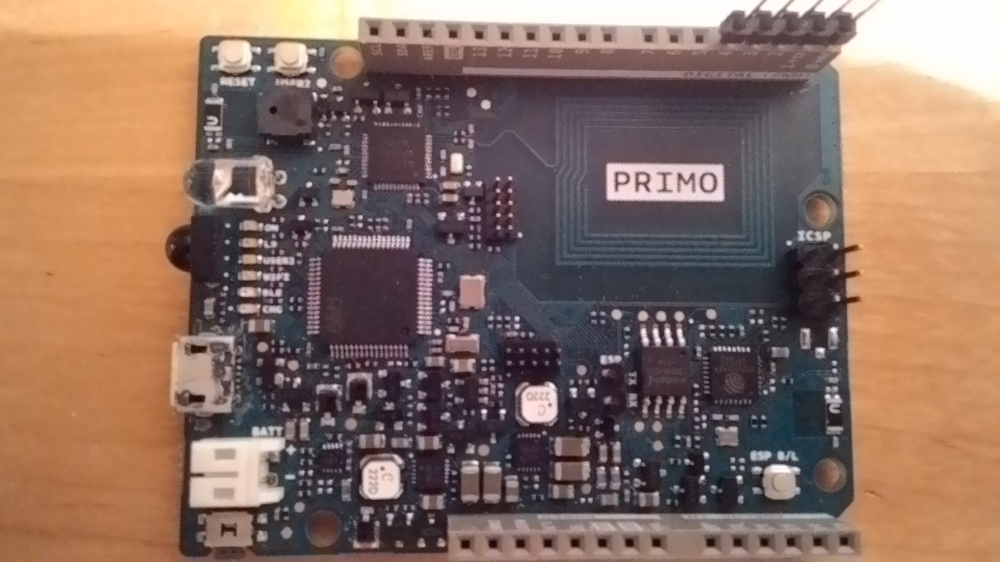

.. _nrf52_primo:

nRF52-PRIMO
##############

Overview
********

Support for the following devices is provided:

* :abbr:`ADC (Analog to Digital Converter)`
* CLOCK
* FLASH
* :abbr:`GPIO (General Purpose Input Output)`
* :abbr:`I2C (Inter-Integrated Circuit)`
* :abbr:`MPU (Memory Protection Unit)`
* :abbr:`NVIC (Nested Vectored Interrupt Controller)`
* :abbr:`PWM (Pulse Width Modulation)`
* RADIO (Bluetooth Low Energy and 802.15.4)
* :abbr:`RTC (nRF RTC System Clock)`
* Segger RTT (RTT Console)
* :abbr:`SPI (Serial Peripheral Interface)`
* :abbr:`UART (Universal asynchronous receiver-transmitter)`
* :abbr:`WDT (Watchdog Timer)`

The nrf52_primo board features a nRF52 SOC plus two other microcontrollers:
an STM32F103 (mostly for SWD debugging) and an ESP8266 providing wifi
connectivity.

Hardware
********

SPI is used for talking to the ESP8266 chip, while the I2C interface is
connected to the STM32 together with the nRF52 SWD signals.
AIN3 is shared with UART2's rx pin, so it cannot be used as an ADC input.

LED
---

* IO13 (yellow) = P0.25

Push buttons
------------

* USER1 = P0.07

Audio
------------

* Buzzer = P0.08

External Connectors
-------------------

SWD

+-------+--------------+
| PIN # | Signal Name  |
+=======+==============+
| 1     | VDD_rRF      |
+-------+--------------+
| 2     | nRF_SWDIO    |
+-------+--------------+
| 3     | GND          |
+-------+--------------+
| 4     | nRF_SWDCLK   |
+-------+--------------+
| 5     | GND          |
+-------+--------------+
| 6     | NC           |
+-------+--------------+
| 7     | NC           |
+-------+--------------+
| 8     | NC           |
+-------+--------------+
| 9     | GND_DETECT   |
+-------+--------------+
| 10    | 52_RST       |
+-------+--------------+

Arduino Headers

J1

+-------+--------------+-------------+
| PIN # | PIN Name     | nRF52 pin   |
+=======+==============+=============+
| 1     | SCL          | P0.27       |
+-------+--------------+-------------+
| 2     | SDA          | P0.26       |
+-------+--------------+-------------+
| 3     | AREF         | P0.02/AIN0  |
+-------+--------------+-------------+
| 4     | GND          |             |
+-------+--------------+-------------+
| 5     | 13           | P0.25       |
+-------+--------------+-------------+
| 6     | 12           | P0.24       |
+-------+--------------+-------------+
| 7     | 11           | P0.23       |
+-------+--------------+-------------+
| 8     | 10           | P0.22       |
+-------+--------------+-------------+
| 9     | 9            | P0.20       |
+-------+--------------+-------------+
| 10    | 8            | P0.19       |
+-------+--------------+-------------+

J2

+-------+--------------+-------------+
| PIN # | PIN Name     | Signal name |
+=======+==============+=============+
| 1     | NC           |             |
+-------+--------------+-------------+
| 2     | IOREF        |    VDD33    |
+-------+--------------+-------------+
| 3     | RESET        |   RESET     |
+-------+--------------+-------------+
| 4     | 3.3V         |    VDD33    |
+-------+--------------+-------------+
| 5     | 5V           |     5V      |
+-------+--------------+-------------+
| 6     | GND          |    GND      |
+-------+--------------+-------------+
| 7     | GND          |    GND      |
+-------+--------------+-------------+
| 8     | VIN          |    VIN      |
+-------+--------------+-------------+

J3

+-------+--------------+-------------+
| PIN # | PIN Name     | nRF52 pin   |
+=======+==============+=============+
| 1     | A0           | P0.03/AIN0  |
+-------+--------------+-------------+
| 2     | A1           | P0.04/AIN1  |
+-------+--------------+-------------+
| 3     | A2           | P0.28/AIN4  |
+-------+--------------+-------------+
| 4     | A3           | P0.29/AIN5  |
+-------+--------------+-------------+
| 5     | A4           | P0.30/AIN6  |
+-------+--------------+-------------+
| 6     | A5           | P0.31/AIN7  |
+-------+--------------+-------------+

J4

+-------+--------------+-------------+
| PIN # | PIN Name     | nRF52 pin   |
+=======+==============+=============+
| 1     | 7            | P0.18       |
+-------+--------------+-------------+
| 2     | 6            | P0.17       |
+-------+--------------+-------------+
| 3     | 5            | P0.16       |
+-------+--------------+-------------+
| 4     | 4            | P0.15       |
+-------+--------------+-------------+
| 5     | 3            | P0.14       |
+-------+--------------+-------------+
| 6     | 2            | P0.13       |
+-------+--------------+-------------+
| 7     | 1->TX        | P0.12       |
+-------+--------------+-------------+
| 8     | 0<-RX        | P0.11       |
+-------+--------------+-------------+

Programming and Debugging
*************************

Flashing
--------

Openocd can be used for flashing.

First, connect the board to a PC via USB (J8 USB micro connector).
Next, start openocd on the pc like this:

.. code-block:: console

   $ openocd -f nrf52_primo.cfg

Where file nrf52_primo.cfg contains the following:

.. code-block:: console

    # nRF52 Primo board (nRF52832)
    source [find interface/cmsis-dap.cfg]
    source [find target/nrf52.cfg]

Then build and flash the application in the usual way.

.. zephyr-app-commands::

   :zephyr-app: samples/hello_world
   :board: nrf52_primo
   :goals: build flash

  start gdb and load the program to flash:

.. code-block:: console

   $ arm-none-eabi-gdb hello_world.elf
   (gdb) target remote localhost:3333
   (gdb) load

   Debugging
   =========

openocd/gdb can also be used for debugging

Testing the LEDs and buttons on the nRF52 primo
***********************************************

There are 2 samples that allow you to test that the buttons (switches) and LEDs on
the board are working properly with Zephyr:

.. code-block:: console

   samples/basic/blinky
   samples/basic/button

You can build and flash the examples to make sure Zephyr is running correctly on
your board. The button and LED definitions can be found in
:file:`boards/arm/nrf52_primo/board.h`.

References
**********

.. target-notes::

FIXME: ADD STUFF HERE
